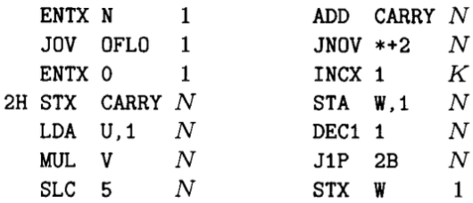

A perfect power is an integer <i>m</i> whose <i>n</i><sup>th</sup> root is an integer <i>a</i>.  That is, &mdash;


For a very long time, intermittently, I have been trying to write an efficient function to check if a number is a perfect power or not.  It's been about 5 months now actually, and I can't remember why.  All I recall is that I wanted to know specifically if a number was a perfect power or not&mdash;not necessarily what numbers combine to produce the given number.

I think I came across the issue when doing coding theory.  There is no known perfect codes for alphabet size of non-perfect-powers.  And I was wondering if there is a good programmatic solution to this.

Well, the naïve solution is to check every combination:
```julia
for a in 1:m
	for n in 1:m
		a^n == m && return true
	end
end

return false
```

But this is very slow.  In fact, fast *enough* for 8-bit integers, but extremely slow for anything more.

After some searching, I found a 1997 article by Daniel J. Bernstein titled ["Detecting Perfect Powers in Essentially Linear Time"](https://cr.yp.to/papers/powers.pdf).  After days of trying to translate this into Julia, I realised that he had used his own floating point number representation that he heavily relied on in his logic...  This is something I don't want to have to do: reinvent the <strike>wheel</strike> `Float`.  He also used a `divrem` method that required some some steps digit-by-digits, designed by Knuth:

My port into Julia is certainly not the fastest solution.  I figured that anything I wrote would likely not be as theoretically efficient as in the paper.

So I contacted Mr. Bernstein asking for advice.  He got back to me referencing another paper&mdash;an updated version of the former&mdash;which he also wrote, in 2004, titled ["Factoring into coprimes in essentially linear time"](https://cr.yp.to/lineartime/powers2-20060914-ams.pdf).  I started workin on this one in Julia too, but was stuck at the first step...in which he uses the previous paper to generate a list of prime powers (which, let's not forget, are <i>themselves</i> perfect powers)...  Beginning to feel very circular!

I put this project on the back burner while I wrapped up my exploratory work with Dillon Mayhew, but just this evening it has found me again.  I was looking through my GitHub stars, and I found [IntegerSequences.jl](https://github.com/OpenLibMathSeq/IntegerSequences.jl), which looks to be largely written by one Peter Luschny.  I looked through the code because I was curious, and found an `isPrimePower` function!  Looking deeper, I extracted the bits I needed, and modified/optimised the code a little, and came up with the following:
```julia
using Nemo: isprime, factor, fmpz

function __isprime(n)
	return isprime(fmpz(n))
end

function __factors(n)
	return n == 0 ? [] : factor(fmpz(n))
end

function ω(n)
	nprimedivisors = nothing
	if n == 0
		nprimedivisors = 0
	elseif __isprime(n)
		nprimedivisors = 1
    else
        nprimedivisors = length(__factors(n))
	end

	return fmpz(nprimedivisors)
end

function Ω(n)
    n == fmpz(0) && return 0
    __isprime(n) && return fmpz(1)

    return sum(e for (__, e) ∈ __factors(n))
end

function isperfectpower(n)
	return ω(n) == 1 && Ω(n) != 1
end
```

This is actually blazingly fast.  I did some benchmarking, and I will put the results here.  Unfortunately the only comparisons we can realistically make (as I don't have all night) are ones on small integers, as larger integers simply scale too much for the brute force method.

Perfect Power Implementation | List Type | List Size | Run Time | Number of Allocations | Memory Usage
--- | --- | --- | --- | --- | ---
Brute force (`bf`) | `Int8` | 100 | 1.358 ms | 11 | 2.11 KiB
Clever (`c`) | `Int8` | 100 | 122.749 μs | 2,927 | 170.95 KiB
`bf` | `Int8` | 1,000 | 16.382 ms | 10 | 32.66 KiB
`c` | `Int8` | 1,000 | 1.235 ms | 28,877 | 1.62 MiB
`bf` | `Int8` | 10,000 | 179.624 ms | 12 | 166.48 KiB
`c` | `Int8` | 10,000 | 12.616 ms | 286,870 | 16.25 MiB
`bf` | `Int8` | 1,000,000 | 17.701 s | 12 | 16.21 MiB
`c` | `Int8` | 1,000,000 | 3.141 s | 28,784,244 | 1.59 GiB
`c` | `Int16` | 100 | 23.333 μs | 2,551 | 153.39 KiB
`c` | `Int32` | 100 | 650.484 μs | 2,347 | 152.25 KiB
`c` | `Int64` | 100 | 13.342 ms | 2,044 | 1.30 MiB
`c` | `Int128` | 100 | 4.182 s | 5,547,237 | 960.02 MiB
`c` | `Int128` | 1,000 | 40.835 s | 51,785,224 | 8.46 GiB
`c` | `Int128` | 10,000 | 669.043 s | 532,334,303 | 89.17 GiB


---

Going a bit deeper into why this method works so seemingly efficiently, we need to
