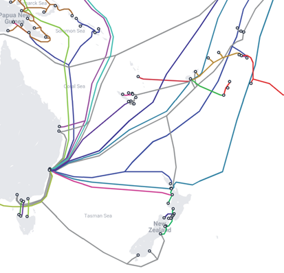

## Introduction

 While the world has its attention turned to Eastern Europe, a political crisis that has developed in the Pacific over the past months may very well be one of the most significant geostrategic challenges for New Zealand’s role in the Pacific within our lifetimes. Media coverage of the Ardern/Biden meeting in late May also suggests that New Zealand has had to engage with a much less benign strategic environment in the Pacific.

In March 2022, a draft security agreement between China and Solomon Islands was leaked online. The agreement could allow China to send military and police personnel to and base naval vessels on the islands as per reports by The Guardian. Additionally, Solomon Islands Prime Minister Mannaseh Sogavare confirmed his government had finalised the security treaty with China while speaking to Solomon Islands’ parliament.

Chinese presence in the Solomon Islands may pose a significant risk to the telecommunications and internet security of other nations in the Pacific region. Moreover, this agreement could allow China to establish a military base as close as &sim;1,400 kilometres from Australia’s North-Eastern border, putting pressure on Australia and giving Beijing increasing strategic leverage over Taiwan.

## Political History

 Great power rivalry in the Pacific goes back a long way: the annexation of Hawaii in 1898 for example, was followed in 1905 by an extraordinary voyage by U.S. Secretary of War William Taft, sent by then-President Roosevelt together with Roosevelt’s daughter and a congressional delegation to Japan, the Philippines, China, and Korea to try to get an agreement to divide up Asia. From 1907–1909, the U.S. deployed 16 warships of its Atlantic Fleet on a goodwill visit to the Pacific (including a visit to Auckland, where 14,500 sailors on shore made quite an impression).

Now it’s China. Since its establishment in 1949, the People’s Republic of China (PRC) initially managed foreign relations with an ideological context and with a generalised Chinese vision of the world. Since the 1990s, after the Chinese separation of foreign policy and ideology was completed under Former President of the PRC Jiang Zemin, his successor Hu Jintao sought to improve China’s security and participation in the global system, emphasising China’s “responsible” standing in the international system by continuing good-neighbour policies while expanding them beyond Asia. This resulted in an increase in Chinese influence in global and regional economic and political development, which was described as a Chinese “charm offensive” and “soft power”. While China’s foreign policy is heavily influenced by its leaders and how they view the world, many consider Xi Jinping’s current approach to foreign policy a natural continuation of what Hu Jintao started.

Now Chinese power projection has a harder edge, much of it focused on the Taiwan question. Other key issues for Beijing include the militarisation of the South China Sea, and the suppression of local democracy in Hong Kong. In turn this has—at least initially—been accompanied by a continuing push for soft power in the Pacific, offering thousands of scholarships for vocational, diplomatic, and disaster-response training.

## Recent Events

 Now the Chinese push to secure more solid toehold in the southern Pacific has accelerated. On May 30th, 2022, the 2nd PRC-PICS Foreign Ministers Meeting was held between the PRC and the ten Pacific Island countries it has diplomatic relations with, in the interest of a China-inspired Common Development Vision. Some (Solomon Islands and Kiribati) have entered further negotiations. Others are notably sceptical, such as the President of the Federal States of Micronesia (FSM), David Panuelo, called this a “smokescreen” for a larger agenda. Panuelo continued in a letter written to 18 Pacific leaders (including New Zealand, Australia, and the Secretary-General of the Pacific Islands Forum), warning about the sovereignty of the Pacific Island countries, expressing concerns about the security agreement resulting in a cold or world war. The U.S. mirrored these concerns from FSM (unsurprising as the U.S. manages FSM’s foreign affairs), stating this geostrategic challenge is equally important in the possibility of conflict. Panuelo also noted that the Common Development Vision sought to “fundamentally alter what used to be bilateral relations with China into multilateral issues”. The new Australian foreign Minister seems to have succeeded too in ensuring that Fiji rejected the Chinese initiative.

This leaves the security agreement with Solomon Islands in place. This security agreement is itself part of China’s Common Development Vision with Pacific Island nations, whereby China seeks to secure material influence in Pacific islands through law enforcement training, supplying, and joint enforcement efforts, which can be used for the protection of Chinese assets and citizens. The Common Development Vision suggests a cooperation on network and governance, cybersecurity, and equal emphasis on development and security.

The Common Development Vision and Beijing’s influence in the Pacific becomes a much more concerning issue when accounting for recent context in China’s foreign policy. As of late, China’s soft power has declined significantly with Chinese foreign policy becoming increasingly aggressive and coercive. Sanctions, non-tariff barriers and procession restrictions have been increasingly prevalent in Chinese diplomacy in the past few years.

## Consequences of a Chinese Military Base in the Pacific

 The Pacific region has a long history of strategic bases around naval routes and certain infrastructure (initially coaling stations, then telegraph cables, and now internet cables). Internet infrastructure in the Pacific is of particular importance to cybersecurity in New Zealand. In the early 1970s, the U.S. government learned of an undersea cable off the Eastern coast of Russia, connecting two Soviet naval bases. Despite the Soviet Navy restricting foreign ships from entering the region, the NSA launched ‘Operation Ivy Bells’, deploying submarines and combat divers to drop waterproof recording pods onto the cable. The divers would periodically return to collect the tapes, providing the NSA with an insight into Soviet intelligence. Although this project was ended in 1981 when an NSA employee sold this information to the KGB, these cable tapping tactics are far from dead.

David Panuelo succinctly expressed his concerns around the security pact, and the Common Development Vision, stating that the Vision “seeks Chinese control and ownership over our communications infrastructure, as well as customs and quarantine infrastructure … for the purpose of biodata collection and mass surveillance of those residing in, entering and leaving our islands, ostensibly to occur in part through cybersecurity partnership”. Hardly an enticing prospect for a small nation.

<figure>
	
	<figcaption>
		Figure 1: A map detailing the submarine cables around East Australia, New Zealand, and the proximity of Solomon Islands (circled) to key infrastructure.
	</figcaption>
</figure>

 There is much Internet infrastructure in the Pacific, mainly undersea fibre optic cables that facilitate digital communications between countries and servers. Infrastructure adjacent to the Solomon Islands in particular include the Coral Sea Cable System (CS²), which connects the Solomon Islands with Papua New Guinea and Australia (NSW); the Japan-Guam-Australia South (JGA-S) Cable, which passes through Guam and goes to Australia (NSW; past Solomon Islands); and the Australia-Japan Cable (AJC), which goes from Japan to Guam and then to Australia (NSW; past Solomon Islands).

There are some cables connecting Australia—where the aforementioned cables connect to various parts of South-East Asia—and New Zealand. Surrounding these Pacific regions are New Zealand, Australia, and the U.S., all of whom are part of the intelligence alliance, officially created in 1946 known as the Five Eyes.

 Chinese control over Pacific communications infrastructure, ocean territory, and security space provides great advantages to Beijing, should they decide to attempt to take control over Taiwan. The Russo-Ukraine war has made war thinkable, although it may also have highlighted the possible costs of aggression, and the sheer uncertainty of military operations.

Panuelo states that the documents proposed in China’s Common Development Vision makes Pacific countries susceptible to having phone calls and emails intercepted. Forbye, China’s friendship comes at a price; in 2018 it was found that the African Union building built by China in 2009–2012 was bugged, though this was publicly denied by China. The presently proposed documents set a precedent for agreements between other Pacific countries, and further encroaches on territory and sea routes near New Zealand, which is now shaping the strategic threat that Wellington feels—a concern reflected in the reports of the Biden-Ardern meeting.

A possible Chinese naval base in the Pacific would pose a serious risk to the intelligence shared between the Five Eyes nations, as well as a risk to general data privacy in the region. This is problematic for Pacific nations, but the Solomon Islands ultimately get to choose the outcome. The Pacific region is left between the metaphorical Scylla and Charybdis: on one hand, the balance of power in the Pacific is at risk through Chinese influence, but then the Solomon Islands have Western nations and other Pacific nations telling them what to do. Solomon Islanders will all remember the RAMSI mission, where Australian and New Zealand troops and police-maintained order in the Solomons after a period of unrest, from 2003 to 2017. Whatever the outcome of this agreement between China and Solomon Islands, it does not bode well to the confidence in communications infrastructure in the Pacific, with an undeniably key piece of Australia and New Zealand’s infrastructure lying beyond our borders in the realm of a nation being actively courted by another with competing interests in the Pacific.

<figure>
	
	<figcaption>
		Figure 2: The Coral Sea Cable System (CS2) comes ashore.
	</figcaption>
</figure>
